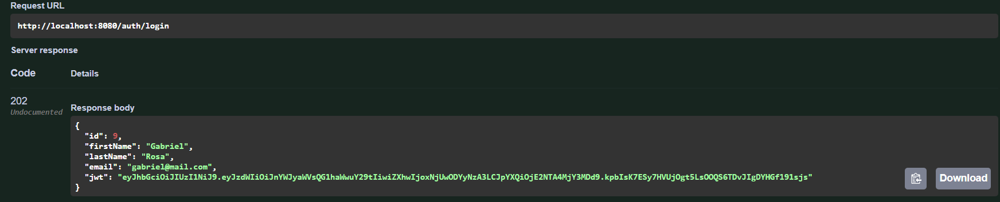
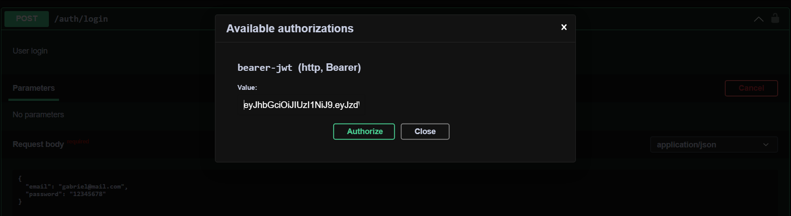

# GRUPO 167 -  Java - Spring Boot (Proyecto: API REST) 🚀

### Objetivo

Proyecto ONG - Somos más. 
Desarrollar una API como parte de un equipo de desarrolladores, deberás desarrollar un sitio que represente a la organización de Marita y el gran esfuerzo que su equipo realiza a la comunidad.

### Herramientas utilizadas
- 👉 Java y Spring Boot
- 👉 Librería Spring Security
- 👉 Las rutas siguen el patrón REST
- 👉 Manejo de Excepciones (Carpeta exception)
- 👉 Guardado de imagenes utilizando el servicio de Amazon AWS.
- 👉 Envio de correos electrónicos mediante el servicio web SendGrid.
- 👉 Paginación.
- 👉 Utilización de DTOs (creación manual).
- 👉 Testing (JUnit y Mockito).
- 👉 Api documentada a través de Swagger.

---------------------------

### Para ejecutar la API 👇🏻
* Descargar el proyecto o clonarlo.
* Abra la consola y vaya a la carpeta del proyecto.
* Ejecute estos comandos: ``` mvn clean install ```  y luego ``` mvn spring-boot:run ``` .
* Abra su navegador e ingrese a http://localhost:8080/swagger-ui/index.html#/ .
* Puede ver la documentación de la API e interactuar con los endpoints.


## Requerimientos técnicos
## 1. A. Modelado de Base de Datos

Además de las caracteristicas descriptas a continucación las entidades cuentan con columnas referidas a: softDelete, modifiedDate y createDate.

**UserEntity:**  deberá tener:
    
     - id
     - firstName.
     - lastName.
     - email.
     - password.
     - roles.
     - photo.

**Role:** deberá tener:

    - id.
    - name.
    - description.
    - users.


**Activity:**  deberá tener:

    - id.
    - name.
    - content.
    - image.

**Cagegory:** deberá tener:

    - id.
    - name.
    - description.
    - image.
 
**Comment:** deberá tener:

    - id.
    - body.
    - user_id.
    - news_id.

**Contact:** deberá tener:

    - id.
    - name.
    - phone.
    - email.
    - message.

**Member:** deberá tener:
    
    - id.
    - name.
    - facebookUrl.
    - instagramUrl.
    - linkedinUrl.
    - image.
    - description.
    - creationDate.
    - updateDate.

**News:** deberá tener:

    - id.   
    - name.   
    - content.   
    - image.   
    - categoryId.

**Organization:** deberá tener:

    - id
    - name.
    - image.
    - address.
    - phone.
    - email.
    - instagramUrl.
    - facebookUrl.
    - linkedInUrl.
    - welcomeText.
    - aboutUsText.

**Slide:** deberá tener:

    - id.
    - imageUrl.
    - text.
    - order.
    - organization_id.

**Testimonial** deberá tener:

     - id.
     - name.
     - image.
     - content.


## 1. B. Seeder
### A través de un SEEDER se encuentran precargados los siguientes usuarios con rol ADMIN Y USER.

**Lista usuarios con ROLE_ADMIN:**
- victor@mail.com
- facundo@mail.com
- andres@mail.com
- pablo@mail.com
- mickaela@mail.com
- agustin@mail.com
- luz@mail.com
- luciano@mail.com
- gabriel@mail.com
- horacio@mail.com

**Lista usuarios con ROLE_USER:**
- diego@mail.com
- carlos@mail.com
- juan@mail.com
- valeria@mail.com
- nicole@mail.com
- norma@mail.com
- raquel@mail.com
- romina@mail.com
- horacio@mail.com
- abel@mail.com

## 1. C. Role Admin
### PATHS habilitados solo para usuarios con ROLE_ADMIN, los demás paths que no están expresamente incluidos en la lista pueden ser accedidos por usuarios con ROLE_USER.

| METHOD | ROLE_ADMIN                                    |
|--------|-----------------------------------------------|
| POST   | http://localhost:8080/auth/addRole/{id}       |
| POST   | http://localhost:8080/auth/updateRolUser/{id} |
| POST   | http://localhost:8080/activities              |
| PUT    | http://localhost:8080/activities/{id}         |
| POST   | http://localhost:8080/categories              |
| POST   | http://localhost:8080/news                    |
| POST   | http://localhost:8080/slides                  |
| POST   | http://localhost:8080/testimonials            |
| PUT    | http://localhost:8080/activities              |
| PUT    | http://localhost:8080/categories/{id}         |
| PUT    | http://localhost:8080/news/{id}               |
| PUT    | http://localhost:8080/organization/public     |
| PUT    | http://localhost:8080/slides/{id}             |
| PUT    | http://localhost:8080/testimonials/{id}       |
| PUT    | http://localhost:8080/users/{id}              |
| GET    | http://localhost:8080/categories              |
| GET    | http://localhost:8080/categories/{id}         |
| GET    | http://localhost:8080/comments                |
| PUT    | http://localhost:8080/comments/{id}           |
| GET    | http://localhost:8080/contacts                |
| GET    | http://localhost:8080/members                 |
| GET    | http://localhost:8080/slides                  |
| GET    | http://localhost:8080/slides/{id}             |
| DELETE | http://localhost:8080/categories/{id}         |
| DELETE | http://localhost:8080/members/{id}            |
| DELETE | http://localhost:8080/news/{id}               |
| DELETE | http://localhost:8080/slides/{id}             |
| DELETE | http://localhost:8080/testimonials/{id}       |


---------------------------

## 2. Autenticación de Usuarios
El usuario despues de registrarse y logearse, obteniene un token, el cual es necesario y requerido para acceder a los demás paths, una vez que pasa 30 minutos el token queda desactualizado o vencido, lo que obliga a que el usuario vuelva a generarlo mediante un nuevo login.

### POST (registro)
	http://localhost:8080/auth/register

Ejemplo:

    {
        "firstName": "Robertito",
        "lastName": "Ramirez",
        "email": "roberT@mail.com",
        "password": "password123",
        "photo": "url.com/imageRober.jpg"
    }

### POST (login)
	http://localhost:8080/auth/login

Ejemplo:

    {   
        "email": "roberT@mail.com",
        "password": "password123"     
    }



Para acceder a cualquier path que requiera rol ("ROLE_USER" o "ROLE_ADMIN"), una vez logeado, se debe ingresar el token.



### POST (actualizar rol de usuario)

	http://localhost:8080/auth/updateRolUser/{id}

Ejemplo:

Path:

    http://localhost:8080/auth/updateRolUser/1

Body:

    {   
      "roleName": "ROLE_ADMIN"   
    }


---------------------------

## 3. Categories

### POST (creación entidad)
	http://localhost:8080/categories

Ejemplo:

    {
        "name": "categoriaName",       
        "description": "descipción de la categoria",
        "image": "url.com/image.jpg"
    }

### PUT (actualización entidad)

	http://localhost:8080/categories/{id}

Ejemplo:

Path:

    http://localhost:8080/categories/1


Body:

    {   
        "name": "cambioDeNombreCategoria",       
        "description": "descipción de la categoria",
        "image": "url.com/image.jpg"
    }

### DELETE (eliminar entidad)

	http://localhost:8080/categories/{id}

Ejemplo:

    http://localhost:8080/categories/1

### GET (buscar una entidad)

	http://localhost:8080/categories/{id}

Ejemplo:

    http://localhost:8080/categories/1

### GET (lista de entidades)

	http://localhost:8080/categories/


---------------------------


## 4. Testimonial

### POST (creación entidad)
	http://localhost:8080/testimonials

Ejemplo:

    {
        "name": "Agostina Suarez",
        "image": "url.com/image.jpg",
        "content": "I love this ONG"
    }

### PUT (actualización entidad)

	http://localhost:8080/testimonials/{id}

Ejemplo:

Path:

    http://localhost:8080/testimonials/1


Body:

    {   
        "name": "Agostino Suaroz",
        "image": "url.com/anotherImage.jpg",
        "content": "I love this ONG"
    }

### DELETE (eliminar entidad)

	http://localhost:8080/testimonials/{id}

Ejemplo:

    http://localhost:8080/testimonials/1

### GET (buscar una entidad)

	http://localhost:8080/testimonials/{id}

Ejemplo:

    http://localhost:8080/testimonials/1

### GET (lista paginadas de entidades)

	http://localhost:8080/testimonials/{page}

Ejemplo:

    http://localhost:8080/testimonials/0


---------------------------


## 5. Slide

### POST (creación entidad)
	http://localhost:8080/slides

Ejemplo:

    {
        "imageUrl": "url.com/image.jpg",
        "text": "Welcome to the web side!",
        "order": 1
    }

### PUT (actualización entidad)

	http://localhost:8080/slides/{id}

Ejemplo:

Path:

    http://localhost:8080/slides/1


Body:

    {   
      "imageUrl": "url.com/anotherImage.jpg",
      "text": "GoodBye to the web side!",
      "order": 3
    }

### DELETE (eliminar entidad)

	http://localhost:8080/slides/{id}

Ejemplo:

    http://localhost:8080/slides/1

### GET (buscar una entidad)

	http://localhost:8080/slides/{id}

Ejemplo:

    http://localhost:8080/slides/1

### GET (lista paginadas de entidades)

	http://localhost:8080/slides/{page}

Ejemplo:

    http://localhost:8080/slides/0

------------------------

## 6. Organization

### POST (creación entidad)
	http://localhost:8080/organization

Ejemplo:

    {
        "name": "Somos más",
        "image": "url.com/image.jpg",
        "address": "av. italia n° 899",
        "phone": "3795552288",
        "email": "someemail@gmail.com",
        "instagramUrl": "InstaSomosmas",
        "facebookUrl": "faceSomosmas",
        "linkedInUrl": "linkdeSomosmas",
        "welcomeText": "hello we are Somosmas",
        "aboutUsText": "we are Somosmas fundation"
    }

### PUT (actualización entidad)

	http://localhost:8080/organization/{id}

Ejemplo:

Path:

    http://localhost:8080/organization/1


Body:

    {
        "name": "Somos menos",
        "image": "url.com/image.jpg",
        "address": "av. italia n° 999",
        "phone": "3795552288",
        "email": "somosMasEmail@gmail.com",
        "instagramUrl": "InstaSomosmas",
        "facebookUrl": "faceSomosmas",
        "linkedInUrl": "linkdeSomosmas",
        "welcomeText": "hello we are Somosmas",
        "aboutUsText": "we are Somosmas fundation"
    }


### GET (buscar una entidad)

	http://localhost:8080/organization/


---------------------------


## 7. News

### POST (creación entidad)
	http://localhost:8080/news

Ejemplo:

    {
        "name": "news name",
        "content": "news content",
        "image": "url.com/image.jpg"
    }

### PUT (actualización entidad)

	http://localhost:8080/news/{id}

Ejemplo:

Path:

    http://localhost:8080/news/1

Body:

    {
        "name": "news name change",
        "content": "news content change",
        "image": "url.com/image.jpg"
    }

### DELETE (eliminar entidad)

	http://localhost:8080/news/{id}

Ejemplo:

    http://localhost:8080/news/1

### GET (buscar una entidad)

	http://localhost:8080/news/{id}

Ejemplo:

    http://localhost:8080/news/1

### GET (lista paginadas de entidades)

	http://localhost:8080/news/{page}

Ejemplo:

    http://localhost:8080/news/0


---------------------------


## 8. Member

### POST (creación entidad)
	http://localhost:8080/members

Ejemplo:

    {
        "name": "Andres Rodriguez",
        "facebookUrl": "facebookAndres",
        "instagramUrl": "instagramAndres",
        "linkedinUrl": "linkedinAndres",
        "image": "ImageUrlAndres",
        "description": "Hello my name is Andres"
    }

### PUT (actualización entidad)

	http://localhost:8080/members/{id}

Ejemplo:

Path:

    http://localhost:8080/members/1

Body:

    {
        "name": "Adrian Romero",
        "facebookUrl": "facebookAndres",
        "instagramUrl": "instagramAndres",
        "linkedinUrl": "linkedinAndres",
        "image": "ImageUrlAndres",
        "description": "Hello my name is Adrian Romero"
    }

### DELETE (eliminar entidad)

	http://localhost:8080/members/{id}

Ejemplo:

    http://localhost:8080/members/1

### GET (buscar una entidad)

	http://localhost:8080/members/{id}

Ejemplo:

    http://localhost:8080/members/1

### GET (lista paginadas de entidades)

	http://localhost:8080/members/{page}

Ejemplo:

    http://localhost:8080/members/0


---------------------------


## 9. Comment

### POST (creación entidad)
	http://localhost:8080/comments

Ejemplo:

    {
        "id": 1,
        "body": "i love the ONG!",
        "userId": 3,
        "newsId": 7
    }

### PUT (actualización entidad)

	http://localhost:8080/comments/{id}


Ejemplo:

Path:

    http://localhost:8080/comments/1

Body:

    {
        "id": 1,
        "body": "i like the ONG!",
        "userId": 3,
        "newsId": 8
    }

### DELETE (eliminar entidad)

	http://localhost:8080/comments/{id}

Ejemplo:

    http://localhost:8080/comments/1

### GET (buscar una entidad)

	http://localhost:8080/comments/posts/{id}/comments

Ejemplo:

    http://localhost:8080/comments/posts/1/comments

### GET (lista paginadas de entidades)

	http://localhost:8080/comments/{page}

Ejemplo:

    http://localhost:8080/comments/0


---------------------------


## 10. Activity

### POST (creación entidad)
	http://localhost:8080/activities

Ejemplo:

    {
        "name": "new activity name",
        "content": "here is the content of the activity",
        "image": "url.com/image.jpg"
    }

### PUT (actualización entidad)

	http://localhost:8080/activities/{id}

Ejemplo:

Path:

    http://localhost:8080/activities/1

Body:

    {
        "name": "name modifed",
        "content": "here is the content of the activity",
        "image": "url.com/image.jpg"
    }

------------------------------


## 11. Contact

### POST (creación entidad)
	http://localhost:8080/contacts

Ejemplo:

    {
        "name": "Agustin",
        "phone": "1145386540",
        "email": "agustin@mail.com",
        "message": "this ONG is fantastic"
    }


### GET (lista de entidades)

	http://localhost:8080/contacts

Ejemplo:

    http://localhost:8080/contacts


---------------------------


## 12. User

### DELETE (eliminar entidad)

	http://localhost:8080/users/{id}

Ejemplo:

    http://localhost:8080/users/1

### GET (buscar una entidad)

	http://localhost:8080/users/{id}

Ejemplo:

    http://localhost:8080/users/1

### GET (lista de entidades)

	http://localhost:8080/users

Ejemplo:

    http://localhost:8080/users


## El equipo de Desarrollo 🖥️

* **Agustín García** - [LinkedIn](https://www.linkedin.com/in/agustin-garcia-1303191b1 ) - [GitHub](https://github.com/agusgar409)
* **Andrés Rodriguez** - [LinkedIn](https://www.linkedin.com/in/andres-rodriguez-60a166208/) - [GitHub](https://github.com/AndrRod)
* **Facundo Villalba** - [LinkedIn](https://www.linkedin.com/in/facundo-villalba-a7909238/) - [GitHub](https://github.com/facuvillalba)
* **Luciano Lattante** - [LinkedIn](https://www.linkedin.com/in/luciano-lattante) - [GitHub](https://github.com/lucianoLattante)
* **María Luz Brito** - [LinkedIn](https://www.linkedin.com/in/maria-luz-brito/) - [GitHub](https://github.com/britomluz)
* **Mickaela Tarazaga** - [LinkedIn](https://www.linkedin.com/in/mickaelatarazaga/) - [GitHub](https://www.linkedin.com/in/mickaelatarazaga/)
* **Pablo Ibañez** - [LinkedIn](https://www.linkedin.com/in/pablo-ibañez-442046218/ ) - [GitHub](https://github.com/kbza91)
* **Victor Salvatierra** - [LinkedIn](https://www.linkedin.com/in/victor-salvatierra-910a88211/) - [GitHub](https://github.com/salvatierra1)

## Nuestro Mentor 🤓
* **Yamil Amado Selene** - [LinkedIn](https://www.linkedin.com/in/yamil-amado-selene/)

## ESTE PROYECTO ES PARTE DE LA ACELERACIÓN DE [ALKEMY](https://www.alkemy.org/) ❤️

* Nuestro agradecimiento para ellos que brindaron esta oportunidad y nos facilitan el camino para ingresar al mundo laboral IT.

